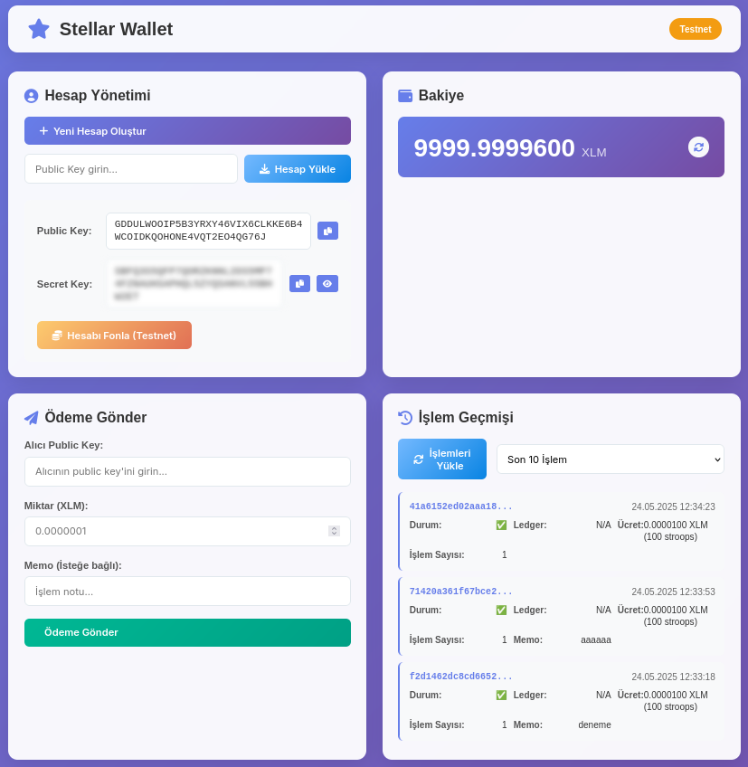

# Stellar Wallet Project



Modern ve etkili bir Stellar blockchain cüzdan ve ödeme sistemi. Bu proje Stellar ağında hesap oluşturma, bakiye sorgulama, ödeme gönderme ve işlem geçmişi görüntüleme özelliklerini sunmaktadır.

## 🌟 Özellikler

- **Hesap Yönetimi**: Yeni Stellar hesapları oluşturma ve mevcut hesapları yükleme
- **Bakiye Sorgulama**: XLM ve diğer varlık bakiyelerini görüntüleme
- **Ödeme Gönderme**: Güvenli ve hızlı XLM transferi
- **İşlem Geçmişi**: Detaylı işlem kayıtlarını görüntüleme
- **Testnet Desteği**: Güvenli test ortamında geliştirme
- **Modern UI**: Responsive ve kullanıcı dostu arayüz

## 🚀 Hızlı Başlangıç

### Gereksinimler

- Node.js (v14 veya üzeri)
- npm veya yarn

### Kurulum

1. **Bağımlılıkları yükleyin:**

   ```bash
   npm install
   ```

2. **Geliştirme sunucusunu başlatın:**

   ```bash
   npm run dev
   ```

3. **Tarayıcınızda açın:**
   ```
   http://localhost:3000
   ```

### Üretim için Çalıştırma

```bash
npm start
```

### Testleri Çalıştırma

```bash
npm test
```

## 🧪 Test Durumu

✅ **Tüm testler başarıyla geçti!**

- ✅ Birim testler (stellarService.test.js)
- ✅ Integrasyon testleri (integration.test.js)
- ✅ API endpoint'leri test edildi
- ✅ Web arayüzü çalışıyor

### Test Sonuçları:

```
Test Suites: 2 passed, 2 total
Tests:       7 passed, 7 total
Snapshots:   0 total
Time:        0.602 s
```

## 📁 Proje Yapısı

```
stellar-projects/
├── server.js              # Ana sunucu dosyası
├── package.json           # Proje bağımlılıkları
├── .env                  # Çevre değişkenleri
├── routes/
│   └── stellar.js        # Stellar API rotaları
├── services/
│   └── stellarService.js # Stellar blockchain servisi
├── public/
│   ├── index.html        # Ana web sayfası
│   ├── script.js         # Frontend JavaScript
│   └── styles.css        # CSS stilleri
└── tests/
    └── stellarService.test.js # Birim testler
```

## 🔧 API Endpoints

### Hesap İşlemleri

- `POST /api/stellar/account/create` - Yeni hesap oluştur
- `POST /api/stellar/account/fund` - Hesabı fonla (testnet)
- `GET /api/stellar/account/:publicKey/balance` - Bakiye sorgula

### Ödeme İşlemleri

- `POST /api/stellar/payment/send` - Ödeme gönder

### İşlem Geçmişi

- `GET /api/stellar/account/:publicKey/transactions` - İşlem geçmişi

## 🌐 Stellar Network

Bu proje Stellar testnet üzerinde çalışmaktadır:

- **Network**: Testnet
- **Horizon URL**: https://horizon-testnet.stellar.org
- **Friendbot**: Hesap fonlama için testnet friendbot kullanılır

## 🔐 Güvenlik

- Private key'ler sadece gerekli işlemler için kullanılır
- Testnet ortamında güvenli geliştirme
- Input validasyonu ve error handling
- CORS koruması aktif

## 📱 Kullanım

1. **Hesap Oluşturma**: "Yeni Hesap Oluştur" butonuna tıklayın
2. **Hesap Fonlama**: Testnet için "Hesabı Fonla" butonunu kullanın
3. **Bakiye Kontrol**: Otomatik olarak güncellenen bakiye bilgisi
4. **Ödeme Gönderme**: Alıcı public key ve miktar girerek ödeme gönderin
5. **İşlem Geçmişi**: "İşlemleri Yükle" ile geçmiş işlemleri görüntüleyin

## 🛠️ Teknolojiler

- **Backend**: Node.js, Express.js
- **Blockchain**: Stellar SDK
- **Frontend**: Vanilla JavaScript, HTML5, CSS3
- **Testing**: Jest
- **Development**: Nodemon

## 📄 Lisans

MIT License

## 🤝 Katkıda Bulunma

1. Bu repository'yi fork edin
2. Feature branch oluşturun (`git checkout -b feature/amazing-feature`)
3. Değişikliklerinizi commit edin (`git commit -m 'Add amazing feature'`)
4. Branch'inizi push edin (`git push origin feature/amazing-feature`)
5. Pull Request oluşturun

## 📞 İletişim

Herhangi bir sorunuz olursa issue açabilirsiniz.

## 📄 Lisans

Bu proje MIT lisansı altında yayınlanmıştır. Detaylar için [LICENSE](LICENSE) dosyasına bakın.

---

⭐ Bu projeyi beğendiyseniz yıldız vermeyi unutmayın!
